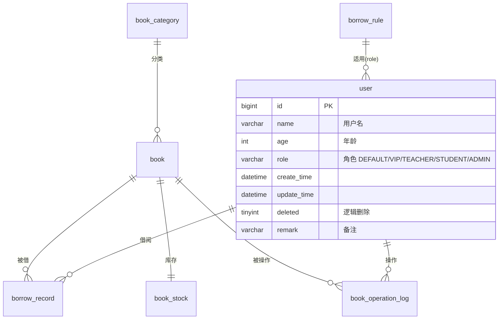
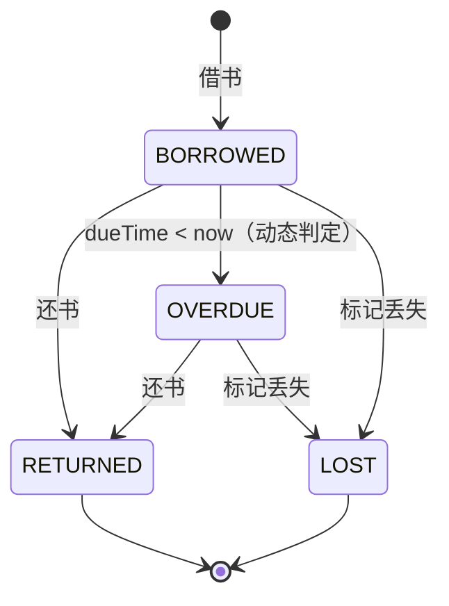

# 图书管理系统数据库设计文档

## 1. 文档说明

本文档描述图书管理系统的核心数据库表设计，覆盖用户、图书、分类、库存、借阅记录、操作日志和借阅规则等全部业务。

已支撑以下核心流程：

- 用户管理
- 图书与分类管理
- 库存管理（入库、盘点、调整）
- 借书、还书、续借、标记丢失
- 借阅规则按角色配置
- 操作日志追踪

## 2. ER 图



## 3. 表清单

| 表名 | 中文名 | Flyway 版本 | 说明 |
| --- | --- | --- | --- |
| `user` | 用户表 | V1 + V4 | 存储用户信息及角色，V4 新增 `role` 字段 |
| `book_category` | 图书分类表 | V2 | 支持父子级树形结构 |
| `book` | 图书表 | V2 | 存储图书基础信息 |
| `book_stock` | 图书库存表 | V3 | 每本图书的库存统计，与 book 一对一 |
| `borrow_record` | 借阅记录表 | V3 | 借书、还书、逾期、丢失等记录 |
| `book_operation_log` | 操作日志表 | V3 | 图书相关操作审计日志 |
| `borrow_rule` | 借阅规则表 | V3 | 按角色配置借阅限制 |

## 4. 表关系

```text
user  1 ──── N  borrow_record       (user_id)
user  1 ──── N  book_operation_log  (operator_id)
book  1 ──── 1  book_stock          (book_id)
book  1 ──── N  borrow_record       (book_id)
book  1 ──── N  book_operation_log  (book_id)
book_category 1 ──── N book         (category_id)
borrow_rule ── 逻辑关联 ── user     (通过 role 字段匹配)
```

说明：

- 一个用户可有多条借阅记录，角色决定适用的借阅规则
- 一本图书对应一条库存记录，创建图书时自动初始化（total=available=0）
- 借阅、归还、续借、标记丢失等操作自动写入操作日志

## 5. 表结构（与实际 DDL 一致）

### 5.1 用户表 `user`

| 字段名 | 类型 | 必填 | 默认值 | 说明 |
| --- | --- | --- | --- | --- |
| `id` | `BIGINT` | 是 | 自增 | 主键 ID |
| `name` | `VARCHAR(64)` | 是 | 无 | 用户名 |
| `age` | `INT` | 否 | `NULL` | 年龄 |
| `role` | `VARCHAR(32)` | 是 | `DEFAULT` | 用户角色，V4 新增 |
| `create_time` | `DATETIME` | 是 | `NOW()` | 创建时间 |
| `update_time` | `DATETIME` | 是 | `NOW()` | 更新时间 |
| `deleted` | `TINYINT` | 是 | `0` | 逻辑删除：0 未删除，1 已删除 |
| `remark` | `VARCHAR(255)` | 否 | `NULL` | 备注 |

`role` 可选值：

| 值 | 说明 | 对应 borrow_rule |
| --- | --- | --- |
| `DEFAULT` | 普通读者（默认） | maxBorrow=5, 30天, 续借1次, 逾期0.5元/天 |
| `VIP` | VIP 会员 | maxBorrow=10, 60天, 续借3次, 无逾期费 |
| `TEACHER` | 教师 | maxBorrow=8, 45天, 续借2次, 逾期0.2元/天 |
| `STUDENT` | 学生 | maxBorrow=3, 15天, 续借1次, 逾期0.5元/天 |
| `ADMIN` | 管理员 | 无借阅限制规则 |

索引：

- `idx_user_name`：`name` 普通索引（V1）
- `idx_user_role`：`role` 普通索引（V4）

### 5.2 图书分类表 `book_category`

| 字段名 | 类型 | 必填 | 默认值 | 说明 |
| --- | --- | --- | --- | --- |
| `id` | `BIGINT` | 是 | 自增 | 主键 |
| `name` | `VARCHAR(64)` | 是 | 无 | 分类名称 |
| `parent_id` | `BIGINT` | 是 | `0` | 父分类 ID，0 = 一级分类 |
| `sort_order` | `INT` | 是 | `0` | 排序值，越小越靠前 |
| `status` | `TINYINT` | 是 | `1` | 状态：1 启用，0 禁用 |
| `create_time` | `DATETIME` | 是 | `NOW()` | 创建时间 |
| `update_time` | `DATETIME` | 是 | `NOW()` | 更新时间 |

索引：

- `uk_book_category_name_parent`：`(name, parent_id)` 联合唯一索引
- `idx_book_category_parent_id`：`parent_id` 普通索引

### 5.3 图书表 `book`

| 字段名 | 类型 | 必填 | 默认值 | 说明 |
| --- | --- | --- | --- | --- |
| `id` | `BIGINT` | 是 | 自增 | 主键 |
| `isbn` | `VARCHAR(32)` | 否 | `NULL` | ISBN 编号，唯一 |
| `title` | `VARCHAR(128)` | 是 | 无 | 书名 |
| `author` | `VARCHAR(128)` | 否 | `NULL` | 作者 |
| `publisher` | `VARCHAR(128)` | 否 | `NULL` | 出版社 |
| `publish_date` | `DATE` | 否 | `NULL` | 出版日期 |
| `category_id` | `BIGINT` | 否 | `NULL` | 分类 ID |
| `description` | `VARCHAR(1000)` | 否 | `NULL` | 简介 |
| `cover_url` | `VARCHAR(500)` | 否 | `NULL` | 封面地址 |
| `status` | `TINYINT` | 是 | `1` | 状态：1 上架，0 下架 |
| `create_time` | `DATETIME` | 是 | `NOW()` | 创建时间 |
| `update_time` | `DATETIME` | 是 | `NOW()` | 更新时间 |
| `deleted` | `TINYINT` | 是 | `0` | 逻辑删除（@TableLogic） |

索引：

- `uk_book_isbn`：`isbn` 唯一索引
- `idx_book_title`：`title` 普通索引
- `idx_book_category_id`：`category_id` 普通索引

### 5.4 图书库存表 `book_stock`

| 字段名 | 类型 | 必填 | 默认值 | 说明 |
| --- | --- | --- | --- | --- |
| `id` | `BIGINT` | 是 | 自增 | 主键 |
| `book_id` | `BIGINT` | 是 | 无 | 图书 ID，唯一 |
| `total_count` | `INT` | 是 | `0` | 总库存 |
| `available_count` | `INT` | 是 | `0` | 可借数量 |
| `borrowed_count` | `INT` | 是 | `0` | 已借出 |
| `lost_count` | `INT` | 是 | `0` | 丢失数量 |
| `damaged_count` | `INT` | 是 | `0` | 损坏数量 |
| `update_time` | `DATETIME` | 是 | `NOW()` | 更新时间 |

库存恒等式：

> **total_count = available_count + borrowed_count + lost_count + damaged_count**

索引：

- `uk_book_stock_book_id`：`book_id` 唯一索引

### 5.5 借阅记录表 `borrow_record`

| 字段名 | 类型 | 必填 | 默认值 | 说明 |
| --- | --- | --- | --- | --- |
| `id` | `BIGINT` | 是 | 自增 | 主键 |
| `user_id` | `BIGINT` | 是 | 无 | 用户 ID |
| `book_id` | `BIGINT` | 是 | 无 | 图书 ID |
| `borrow_time` | `DATETIME` | 是 | `NOW()` | 借出时间 |
| `due_time` | `DATETIME` | 是 | 无 | 应还时间 |
| `return_time` | `DATETIME` | 否 | `NULL` | 实际归还时间 |
| `status` | `VARCHAR(32)` | 是 | `BORROWED` | 借阅状态 |
| `renew_count` | `INT` | 是 | `0` | 续借次数 |
| `remark` | `VARCHAR(255)` | 否 | `NULL` | 备注 |
| `create_time` | `DATETIME` | 是 | `NOW()` | 创建时间 |
| `update_time` | `DATETIME` | 是 | `NOW()` | 更新时间 |

`status` 状态流转：



索引：

- `idx_borrow_record_user_id`：`user_id`
- `idx_borrow_record_book_id`：`book_id`
- `idx_borrow_record_status`：`status`
- `idx_borrow_record_due_time`：`due_time`

### 5.6 图书操作日志表 `book_operation_log`

| 字段名 | 类型 | 必填 | 默认值 | 说明 |
| --- | --- | --- | --- | --- |
| `id` | `BIGINT` | 是 | 自增 | 主键 |
| `book_id` | `BIGINT` | 否 | `NULL` | 图书 ID |
| `operator_id` | `BIGINT` | 否 | `NULL` | 操作人 ID |
| `operation_type` | `VARCHAR(32)` | 是 | 无 | 操作类型 |
| `before_data` | `TEXT` | 否 | `NULL` | 操作前数据（JSON） |
| `after_data` | `TEXT` | 否 | `NULL` | 操作后数据（JSON） |
| `remark` | `VARCHAR(255)` | 否 | `NULL` | 备注 |
| `create_time` | `DATETIME` | 是 | `NOW()` | 创建时间 |

`operation_type` 可选值：

| 值 | 说明 |
| --- | --- |
| `CREATE_BOOK` | 新增图书 |
| `UPDATE_BOOK` | 修改图书 |
| `DELETE_BOOK` | 删除图书 |
| `ADJUST_STOCK` | 调整库存 |
| `BORROW_BOOK` | 借出图书 |
| `RETURN_BOOK` | 归还图书 |
| `MARK_LOST` | 标记丢失 |
| `MARK_DAMAGED` | 标记损坏 |

> 注意：操作日志由 Service 层在 `@Transactional` 事务内自动写入，不对外暴露 POST 端点。

索引：

- `idx_book_operation_log_book_id`：`book_id`
- `idx_book_operation_log_operator_id`：`operator_id`
- `idx_book_operation_log_create_time`：`create_time`

### 5.7 借阅规则表 `borrow_rule`

| 字段名 | 类型 | 必填 | 默认值 | 说明 |
| --- | --- | --- | --- | --- |
| `id` | `BIGINT` | 是 | 自增 | 主键 |
| `role` | `VARCHAR(32)` | 是 | 无 | 角色标识，唯一 |
| `max_borrow_count` | `INT` | 是 | `5` | 最大可借数量 |
| `max_borrow_days` | `INT` | 是 | `30` | 最大借阅天数 |
| `max_renew_count` | `INT` | 是 | `1` | 最大续借次数 |
| `overdue_fee_per_day` | `DECIMAL(10,2)` | 是 | `0.00` | 每日逾期费用 |
| `status` | `TINYINT` | 是 | `1` | 状态：1 启用，0 禁用 |
| `create_time` | `DATETIME` | 是 | `NOW()` | 创建时间 |
| `update_time` | `DATETIME` | 是 | `NOW()` | 更新时间 |

索引：

- `uk_borrow_rule_role`：`role` 唯一索引

## 6. 建表 SQL（实际执行）

```sql
-- V1: 用户表
CREATE TABLE IF NOT EXISTS `user` (
  `id` BIGINT NOT NULL AUTO_INCREMENT COMMENT '主键ID',
  `name` VARCHAR(64) NOT NULL COMMENT '用户名',
  `age` INT DEFAULT NULL COMMENT '年龄',
  `role` VARCHAR(32) NOT NULL DEFAULT 'DEFAULT' COMMENT '用户角色',
  `create_time` DATETIME NOT NULL DEFAULT CURRENT_TIMESTAMP COMMENT '创建时间',
  `update_time` DATETIME NOT NULL DEFAULT CURRENT_TIMESTAMP ON UPDATE CURRENT_TIMESTAMP COMMENT '更新时间',
  `deleted` TINYINT NOT NULL DEFAULT 0 COMMENT '逻辑删除标识',
  `remark` VARCHAR(255) DEFAULT NULL COMMENT '备注',
  PRIMARY KEY (`id`),
  KEY `idx_user_name` (`name`),
  KEY `idx_user_role` (`role`)
) ENGINE=InnoDB DEFAULT CHARSET=utf8mb4 COLLATE=utf8mb4_unicode_ci COMMENT='用户表';

-- V2: 图书分类表
CREATE TABLE IF NOT EXISTS `book_category` (
  `id` BIGINT NOT NULL AUTO_INCREMENT COMMENT '主键ID',
  `name` VARCHAR(64) NOT NULL COMMENT '分类名称',
  `parent_id` BIGINT NOT NULL DEFAULT 0 COMMENT '父分类ID',
  `sort_order` INT NOT NULL DEFAULT 0 COMMENT '排序值',
  `status` TINYINT NOT NULL DEFAULT 1 COMMENT '状态：1启用，0禁用',
  `create_time` DATETIME NOT NULL DEFAULT CURRENT_TIMESTAMP COMMENT '创建时间',
  `update_time` DATETIME NOT NULL DEFAULT CURRENT_TIMESTAMP ON UPDATE CURRENT_TIMESTAMP COMMENT '更新时间',
  PRIMARY KEY (`id`),
  UNIQUE KEY `uk_book_category_name_parent` (`name`, `parent_id`),
  KEY `idx_book_category_parent_id` (`parent_id`)
) ENGINE=InnoDB DEFAULT CHARSET=utf8mb4 COLLATE=utf8mb4_unicode_ci COMMENT='图书分类表';

-- V2: 图书表
CREATE TABLE IF NOT EXISTS `book` (
  `id` BIGINT NOT NULL AUTO_INCREMENT COMMENT '主键ID',
  `isbn` VARCHAR(32) DEFAULT NULL COMMENT 'ISBN编号',
  `title` VARCHAR(128) NOT NULL COMMENT '书名',
  `author` VARCHAR(128) DEFAULT NULL COMMENT '作者',
  `publisher` VARCHAR(128) DEFAULT NULL COMMENT '出版社',
  `publish_date` DATE DEFAULT NULL COMMENT '出版日期',
  `category_id` BIGINT DEFAULT NULL COMMENT '分类ID',
  `description` VARCHAR(1000) DEFAULT NULL COMMENT '图书简介',
  `cover_url` VARCHAR(500) DEFAULT NULL COMMENT '封面地址',
  `status` TINYINT NOT NULL DEFAULT 1 COMMENT '状态：1上架，0下架',
  `create_time` DATETIME NOT NULL DEFAULT CURRENT_TIMESTAMP COMMENT '创建时间',
  `update_time` DATETIME NOT NULL DEFAULT CURRENT_TIMESTAMP ON UPDATE CURRENT_TIMESTAMP COMMENT '更新时间',
  `deleted` TINYINT NOT NULL DEFAULT 0 COMMENT '逻辑删除',
  PRIMARY KEY (`id`),
  UNIQUE KEY `uk_book_isbn` (`isbn`),
  KEY `idx_book_title` (`title`),
  KEY `idx_book_category_id` (`category_id`)
) ENGINE=InnoDB DEFAULT CHARSET=utf8mb4 COLLATE=utf8mb4_unicode_ci COMMENT='图书表';

-- V3: 库存 + 借阅记录 + 操作日志 + 借阅规则
CREATE TABLE IF NOT EXISTS `book_stock` (
  `id` BIGINT NOT NULL AUTO_INCREMENT COMMENT '主键ID',
  `book_id` BIGINT NOT NULL COMMENT '图书ID',
  `total_count` INT NOT NULL DEFAULT 0 COMMENT '总库存数量',
  `available_count` INT NOT NULL DEFAULT 0 COMMENT '可借数量',
  `borrowed_count` INT NOT NULL DEFAULT 0 COMMENT '已借出数量',
  `lost_count` INT NOT NULL DEFAULT 0 COMMENT '丢失数量',
  `damaged_count` INT NOT NULL DEFAULT 0 COMMENT '损坏数量',
  `update_time` DATETIME NOT NULL DEFAULT CURRENT_TIMESTAMP ON UPDATE CURRENT_TIMESTAMP COMMENT '更新时间',
  PRIMARY KEY (`id`),
  UNIQUE KEY `uk_book_stock_book_id` (`book_id`)
) ENGINE=InnoDB DEFAULT CHARSET=utf8mb4 COLLATE=utf8mb4_unicode_ci COMMENT='图书库存表';

CREATE TABLE IF NOT EXISTS `borrow_record` (
  `id` BIGINT NOT NULL AUTO_INCREMENT COMMENT '主键ID',
  `user_id` BIGINT NOT NULL COMMENT '用户ID',
  `book_id` BIGINT NOT NULL COMMENT '图书ID',
  `borrow_time` DATETIME NOT NULL DEFAULT CURRENT_TIMESTAMP COMMENT '借出时间',
  `due_time` DATETIME NOT NULL COMMENT '应还时间',
  `return_time` DATETIME DEFAULT NULL COMMENT '实际归还时间',
  `status` VARCHAR(32) NOT NULL DEFAULT 'BORROWED' COMMENT '借阅状态',
  `renew_count` INT NOT NULL DEFAULT 0 COMMENT '续借次数',
  `remark` VARCHAR(255) DEFAULT NULL COMMENT '备注',
  `create_time` DATETIME NOT NULL DEFAULT CURRENT_TIMESTAMP COMMENT '创建时间',
  `update_time` DATETIME NOT NULL DEFAULT CURRENT_TIMESTAMP ON UPDATE CURRENT_TIMESTAMP COMMENT '更新时间',
  PRIMARY KEY (`id`),
  KEY `idx_borrow_record_user_id` (`user_id`),
  KEY `idx_borrow_record_book_id` (`book_id`),
  KEY `idx_borrow_record_status` (`status`),
  KEY `idx_borrow_record_due_time` (`due_time`)
) ENGINE=InnoDB DEFAULT CHARSET=utf8mb4 COLLATE=utf8mb4_unicode_ci COMMENT='借阅记录表';

CREATE TABLE IF NOT EXISTS `book_operation_log` (
  `id` BIGINT NOT NULL AUTO_INCREMENT COMMENT '主键ID',
  `book_id` BIGINT DEFAULT NULL COMMENT '图书ID',
  `operator_id` BIGINT DEFAULT NULL COMMENT '操作人ID',
  `operation_type` VARCHAR(32) NOT NULL COMMENT '操作类型',
  `before_data` TEXT DEFAULT NULL COMMENT '操作前数据',
  `after_data` TEXT DEFAULT NULL COMMENT '操作后数据',
  `remark` VARCHAR(255) DEFAULT NULL COMMENT '备注',
  `create_time` DATETIME NOT NULL DEFAULT CURRENT_TIMESTAMP COMMENT '创建时间',
  PRIMARY KEY (`id`),
  KEY `idx_book_operation_log_book_id` (`book_id`),
  KEY `idx_book_operation_log_operator_id` (`operator_id`),
  KEY `idx_book_operation_log_create_time` (`create_time`)
) ENGINE=InnoDB DEFAULT CHARSET=utf8mb4 COLLATE=utf8mb4_unicode_ci COMMENT='图书操作日志表';

CREATE TABLE IF NOT EXISTS `borrow_rule` (
  `id` BIGINT NOT NULL AUTO_INCREMENT COMMENT '主键ID',
  `role` VARCHAR(32) NOT NULL COMMENT '用户角色',
  `max_borrow_count` INT NOT NULL DEFAULT 5 COMMENT '最大可借数量',
  `max_borrow_days` INT NOT NULL DEFAULT 30 COMMENT '最大借阅天数',
  `max_renew_count` INT NOT NULL DEFAULT 1 COMMENT '最大续借次数',
  `overdue_fee_per_day` DECIMAL(10,2) NOT NULL DEFAULT 0.00 COMMENT '每日逾期费用',
  `status` TINYINT NOT NULL DEFAULT 1 COMMENT '状态：1启用，0禁用',
  `create_time` DATETIME NOT NULL DEFAULT CURRENT_TIMESTAMP COMMENT '创建时间',
  `update_time` DATETIME NOT NULL DEFAULT CURRENT_TIMESTAMP ON UPDATE CURRENT_TIMESTAMP COMMENT '更新时间',
  PRIMARY KEY (`id`),
  UNIQUE KEY `uk_borrow_rule_role` (`role`)
) ENGINE=InnoDB DEFAULT CHARSET=utf8mb4 COLLATE=utf8mb4_unicode_ci COMMENT='借阅规则表';
```

## 7. Flyway 迁移历史

| 版本 | 文件 | 内容 |
| --- | --- | --- |
| V1 | `V1__init_schema.sql` | 创建 `user` 表 |
| V2 | `V2__add_book_and_category.sql` | 创建 `book_category`、`book` 表 |
| V3 | `V3__add_bookther.sql` | 创建 `book_stock`、`borrow_record`、`book_operation_log`、`borrow_rule` 表 |
| V4 | `V4__add_user_role.sql` | `user` 表新增 `role` 字段 + 索引 |
