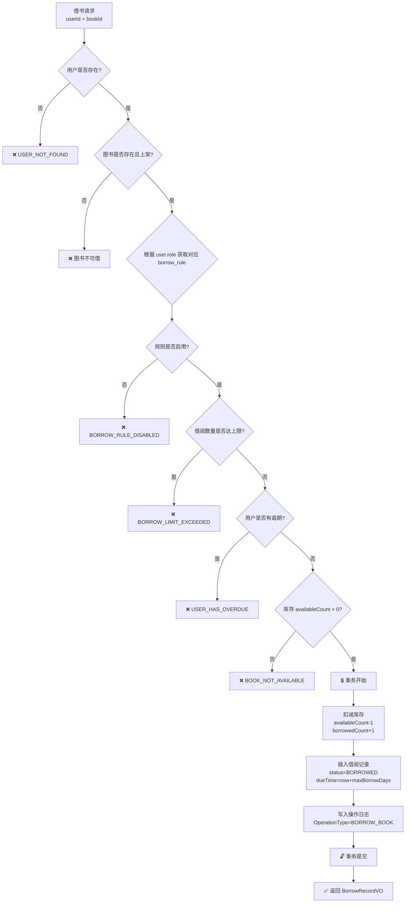
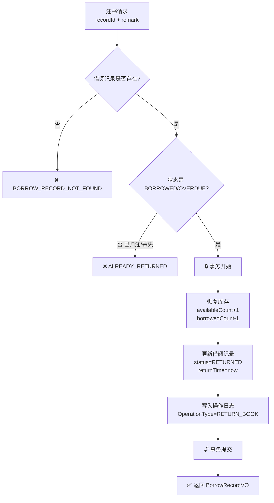
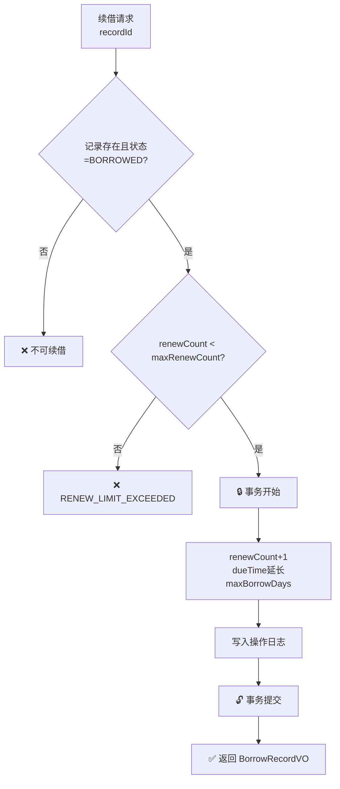
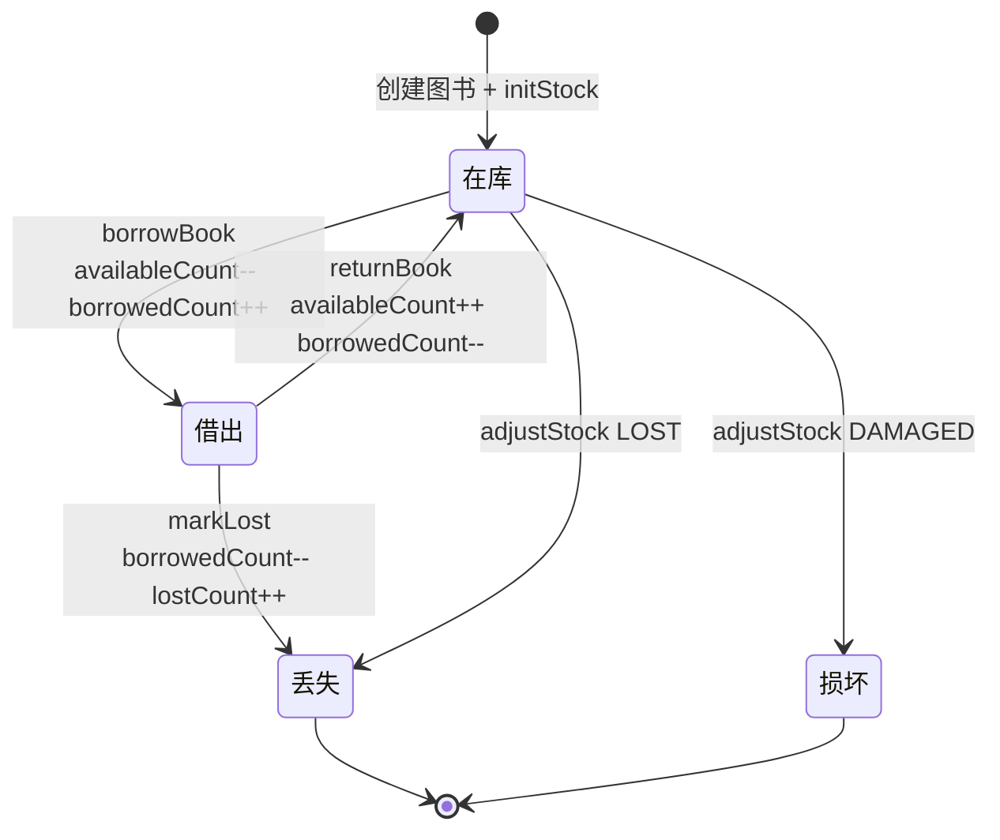
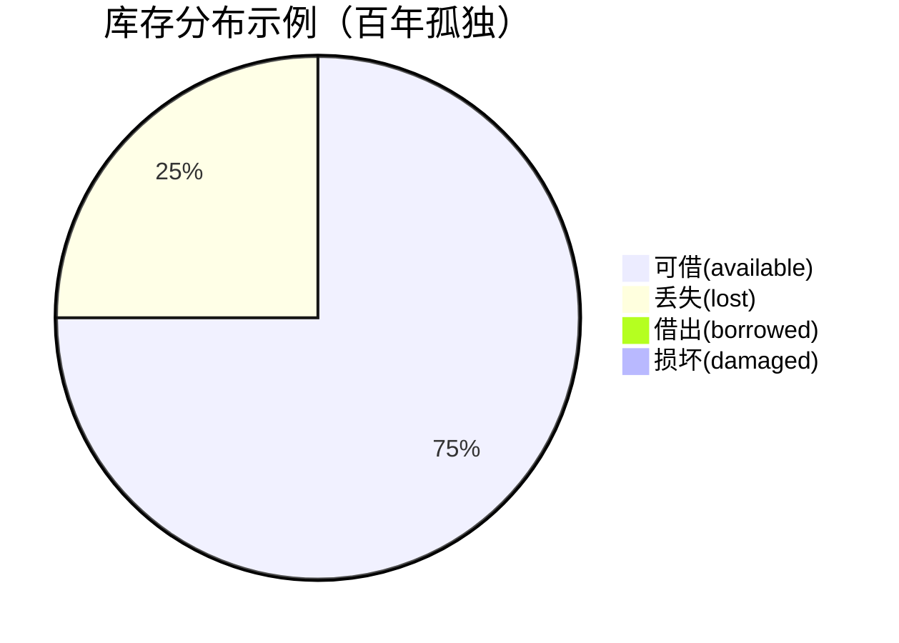
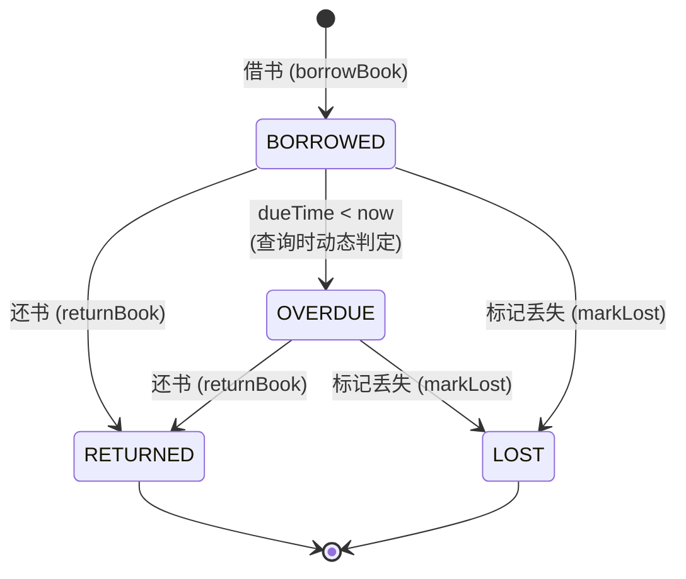

# 数据库设计文档

> 项目：Book Manage 图书管理系统  
> 数据库：MySQL 8.0  
> 生成日期：2026-07-02

---

## 一、ER 图

```mermaid
erDiagram
    user ||--o{ borrow_record : "借阅"
    user ||--o{ book_operation_log : "操作"
    book ||--|| book_stock : "库存"
    book ||--o{ borrow_record : "被借"
    book ||--o{ book_operation_log : "被操作"
    book_category ||--o{ book : "分类"
    borrow_rule ||--o{ user : "适用(role)"

    user {
        bigint id PK "主键"
        varchar name "用户名"
        int age "年龄"
        varchar role "角色 DEFAULT/VIP/TEACHER/STUDENT/ADMIN"
        datetime create_time "创建时间"
        datetime update_time "更新时间"
        tinyint deleted "逻辑删除 0否1是"
        varchar remark "备注"
    }

    book_category {
        bigint id PK "主键"
        varchar name "分类名称"
        bigint parent_id "父分类ID 0=一级"
        int sort_order "排序值"
        tinyint status "状态 1启用0禁用"
        datetime create_time "创建时间"
        datetime update_time "更新时间"
    }

    book {
        bigint id PK "主键"
        varchar isbn UK "ISBN编号"
        varchar title "书名"
        varchar author "作者"
        varchar publisher "出版社"
        date publish_date "出版日期"
        bigint category_id FK "分类ID"
        varchar description "图书简介"
        varchar cover_url "封面地址"
        tinyint status "状态 1上架0下架"
        tinyint deleted "逻辑删除 0否1是"
        datetime create_time "创建时间"
        datetime update_time "更新时间"
    }

    book_stock {
        bigint id PK "主键"
        bigint book_id UK_FK "图书ID 一对一"
        int total_count "总库存"
        int available_count "可借数量"
        int borrowed_count "已借出"
        int lost_count "丢失数量"
        int damaged_count "损坏数量"
        datetime update_time "更新时间"
    }

    borrow_record {
        bigint id PK "主键"
        bigint user_id FK "用户ID"
        bigint book_id FK "图书ID"
        datetime borrow_time "借出时间"
        datetime due_time "应还时间"
        datetime return_time "实际归还"
        varchar status "BORROWED/RETURNED/OVERDUE/LOST"
        int renew_count "续借次数"
        varchar remark "备注"
        datetime create_time "创建时间"
        datetime update_time "更新时间"
    }

    book_operation_log {
        bigint id PK "主键"
        bigint book_id FK "图书ID"
        bigint operator_id FK "操作人ID"
        varchar operation_type "操作类型"
        text before_data "操作前数据JSON"
        text after_data "操作后数据JSON"
        varchar remark "备注"
        datetime create_time "创建时间"
    }

    borrow_rule {
        bigint id PK "主键"
        varchar role UK "角色标识"
        int max_borrow_count "最大可借数"
        int max_borrow_days "最大借阅天数"
        int max_renew_count "最大续借次数"
        decimal overdue_fee_per_day "每日逾期费"
        tinyint status "状态 1启用0禁用"
        datetime create_time "创建时间"
        datetime update_time "更新时间"
    }
```

---

## 二、核心业务流程图

### 2.1 借书流程



### 2.2 还书流程



### 2.3 续借流程



---

## 三、库存状态流转



### 库存恒等式

> **total_count = available_count + borrowed_count + lost_count + damaged_count**



---

## 四、借阅状态流转



---

## 五、表关系矩阵

| 主表 | 关联表 | 关系 | 关联字段 | 说明 |
|------|--------|------|----------|------|
| `book` | `book_stock` | **1:1** | `book.id = book_stock.book_id` | 每本书对应一条库存记录，创建时自动初始化 |
| `book` | `book_category` | **N:1** | `book.category_id = book_category.id` | 每本书属于一个分类 |
| `book_category` | `book_category` | **自引用** | `parent_id → id` | 树形结构，0 表示根节点 |
| `user` | `borrow_record` | **1:N** | `user.id = borrow_record.user_id` | 一个用户可有多条借阅记录 |
| `book` | `borrow_record` | **1:N** | `book.id = borrow_record.book_id` | 一本书可被多人借阅（历史） |
| `user` | `book_operation_log` | **1:N** | `user.id = book_operation_log.operator_id` | 一个操作人可操作多次 |
| `book` | `book_operation_log` | **1:N** | `book.id = book_operation_log.book_id` | 一本书可有多条操作日志 |
| `borrow_rule` | `user` | **逻辑关联** | `borrow_rule.role = ?` | 通过用户角色匹配，非外键约束 |

---

## 六、索引一览

### 6.1 主键索引（所有表）

| 表 | 主键 | 类型 |
|----|------|------|
| 全部 7 张表 | `id` | BIGINT AUTO_INCREMENT |

### 6.2 唯一索引

| 表 | 索引名 | 字段 |
|----|--------|------|
| `book` | `uk_book_isbn` | `isbn` |
| `book_category` | `uk_book_category_name_parent` | `(name, parent_id)` |
| `book_stock` | `uk_book_stock_book_id` | `book_id` |
| `borrow_rule` | `uk_borrow_rule_role` | `role` |

### 6.3 普通索引

| 表 | 索引名 | 字段 | 用途 |
|----|--------|------|------|
| `user` | `idx_user_name` | `name` | 用户名查询 |
| `user` | `idx_user_role` | `role` | 按角色查询用户 (V4) |
| `book` | `idx_book_title` | `title` | 书名模糊搜索 |
| `book` | `idx_book_category_id` | `category_id` | 按分类查询 |
| `book_category` | `idx_book_category_parent_id` | `parent_id` | 子分类查询 |
| `borrow_record` | `idx_borrow_record_user_id` | `user_id` | 用户借阅记录 |
| `borrow_record` | `idx_borrow_record_book_id` | `book_id` | 图书借阅记录 |
| `borrow_record` | `idx_borrow_record_status` | `status` | 按状态过滤 |
| `borrow_record` | `idx_borrow_record_due_time` | `due_time` | 逾期检测查询 |
| `book_operation_log` | `idx_book_operation_log_book_id` | `book_id` | 按图书查日志 |
| `book_operation_log` | `idx_book_operation_log_operator_id` | `operator_id` | 按操作人查日志 |
| `book_operation_log` | `idx_book_operation_log_create_time` | `create_time` | 按时间排序 |

---

## 七、关键 SQL 场景

### 7.1 逾期检测

```sql
-- 查找当前所有逾期未还的记录
SELECT br.*, u.name, b.title
FROM borrow_record br
JOIN user u ON br.user_id = u.id
JOIN book b ON br.book_id = b.id
WHERE br.status = 'BORROWED'
  AND br.due_time < NOW();
```

### 7.2 用户借阅统计

```sql
-- 统计各用户当前借阅数量
SELECT u.id, u.name, COUNT(br.id) AS borrowed_count
FROM user u
LEFT JOIN borrow_record br ON u.id = br.user_id AND br.status = 'BORROWED'
GROUP BY u.id, u.name
ORDER BY borrowed_count DESC;
```

### 7.3 热门图书排行

```sql
-- 借阅次数最多的图书 TOP10
SELECT b.id, b.title, COUNT(br.id) AS borrow_times
FROM book b
LEFT JOIN borrow_record br ON b.id = br.book_id
GROUP BY b.id, b.title
ORDER BY borrow_times DESC
LIMIT 10;
```

### 7.4 库存校验

```sql
-- 检查库存恒等式是否成立（可用于数据审计）
SELECT
    book_id,
    total_count,
    available_count + borrowed_count + lost_count + damaged_count AS calculated_total,
    CASE WHEN total_count = available_count + borrowed_count + lost_count + damaged_count
         THEN 'OK' ELSE 'INCONSISTENT' END AS status
FROM book_stock;
```

---

## 八、Flyway 迁移历史

| 版本 | 文件 | 内容 |
|------|------|------|
| V1 | `V1__init_schema.sql` | `user` 用户表 |
| V2 | `V2__add_book_and_category.sql` | `book_category` 分类表 + `book` 图书表 |
| V3 | `V3__add_bookther.sql` | `book_stock` 库存表 + `borrow_record` 借阅记录表 + `book_operation_log` 操作日志表 + `borrow_rule` 借阅规则表 |
| V4 | `V4__add_user_role.sql` | `user` 表新增 `role` 字段 + `idx_user_role` 索引 |
