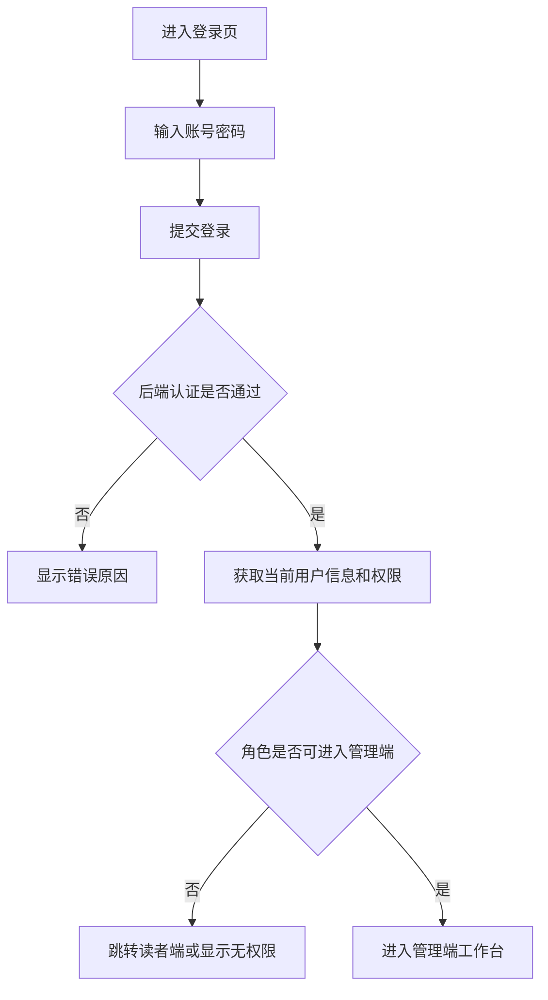
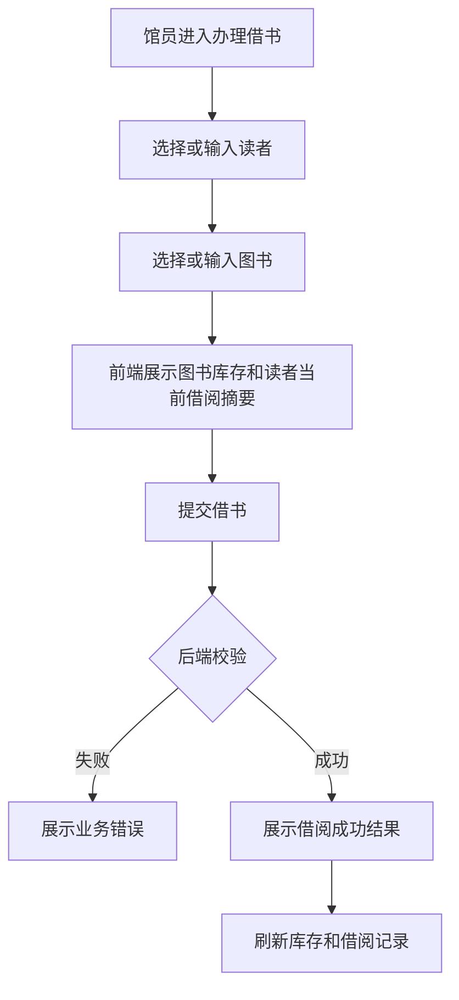
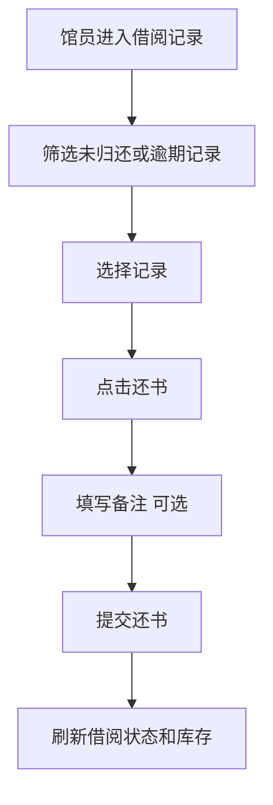
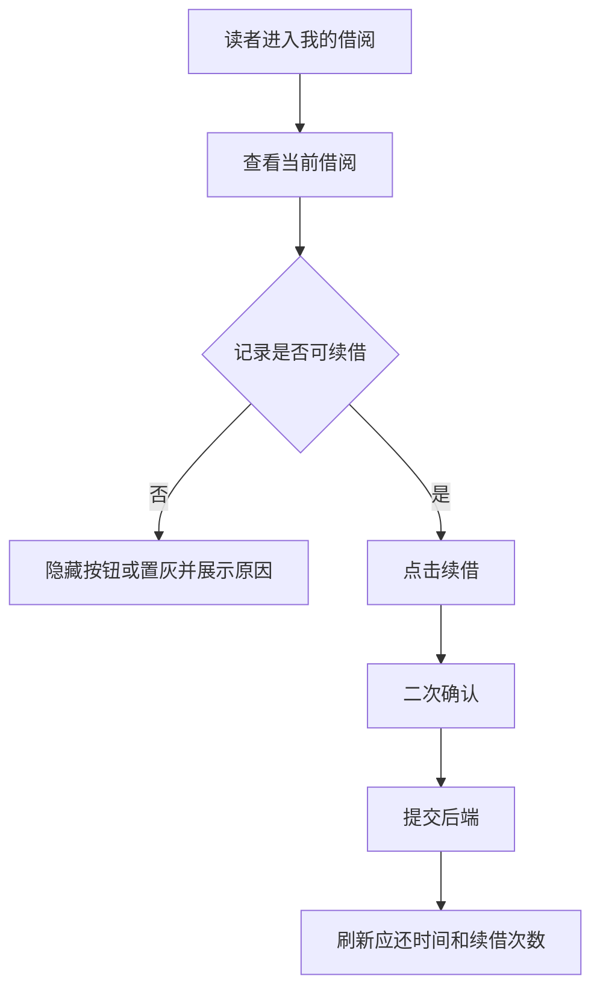

# 图书馆 PC Web 前端 PRD

**创建日期**：2026-07-02  
**版本**：v1.0  
**适用项目**：Book Manage 图书管理系统  
**范围**：PC Web 前端产品需求，不包含前端技术栈选型和代码实现。

## 目录

- [1. 背景与目标](#1-背景与目标)
- [2. 产品范围](#2-产品范围)
- [3. 用户角色](#3-用户角色)
- [4. 权限说明](#4-权限说明)
- [5. 信息架构](#5-信息架构)
- [6. 核心业务流程](#6-核心业务流程)
- [7. 页面需求](#7-页面需求)
- [8. 数据与接口需求](#8-数据与接口需求)
- [9. 非功能需求](#9-非功能需求)
- [10. 验收标准](#10-验收标准)
- [11. 迭代建议](#11-迭代建议)
- [12. 待确认事项](#12-待确认事项)

## 1. 背景与目标

当前后端项目已经具备用户、图书、分类、库存、借阅记录、借阅规则和操作日志等核心业务模块。为了让系统能够被图书馆工作人员和读者实际使用，需要设计一套 PC Web 前端。

本 PRD 的目标是定义图书馆 PC Web 的产品范围、页面结构、业务流程和验收标准，为后续 UI 设计、接口补齐和前端开发提供依据。

### 1.1 产品目标

- 为馆员提供稳定、高效的图书馆日常管理后台。
- 为读者提供图书检索、借阅状态查看和续借等自助能力。
- 让前端页面与现有后端业务模块保持一致，优先复用已有接口能力。
- 权限能力由后端实现，前端负责根据后端返回的用户身份、权限结果进行菜单、按钮和路由展示控制。

### 1.2 成功指标

- 馆员可以完成图书入库、编辑、上下架、库存调整、借书、还书、续借和丢失登记。
- 管理员可以维护读者、分类、借阅规则，并查看操作日志。
- 读者可以查询图书、查看自己的借阅记录，并对符合条件的记录发起续借。
- 所有核心操作都有明确的成功、失败、空状态和加载状态反馈。

## 2. 产品范围

### 2.1 一期包含

- 登录页和基础登录态感知。
- 管理端工作台。
- 图书管理。
- 图书分类管理。
- 库存管理。
- 借阅管理。
- 读者管理。
- 借阅规则管理。
- 操作日志查看。
- 读者个人中心。
- 读者图书检索。
- 读者借阅记录和续借。

### 2.2 一期不包含

- 移动端、小程序、App。
- 复杂权限配置页面，例如权限点、角色菜单、数据范围配置。
- 在线支付、罚金支付。
- 扫码枪、条形码打印、RFID 设备对接。
- Excel 导入导出。
- 消息通知、站内信、短信、邮件。
- 图书预约排队。
- 多馆区、多校区、多租户。

### 2.3 二期候选

- 预约借书。
- 罚金计算与缴费。
- 批量导入图书、读者。
- 图书标签和推荐。
- 数据统计报表。
- 操作审计增强。
- 条码/二维码借还书。

## 3. 用户角色

| 角色 | 说明 | 典型任务 |
| --- | --- | --- |
| 管理员 | 系统管理者，拥有全部管理能力 | 用户管理、规则配置、图书管理、日志查看 |
| 馆员 | 图书馆日常业务人员 | 图书维护、库存调整、借书、还书、续借、丢失登记 |
| 读者 | 图书馆借阅用户 | 查询图书、查看借阅、续借 |

当前数据库用户角色已有 `DEFAULT`、`VIP`、`TEACHER`、`STUDENT`、`ADMIN`。前端产品语义建议：

- `ADMIN`：管理员。
- `DEFAULT`、`VIP`、`TEACHER`、`STUDENT`：读者类型，用于匹配借阅规则。
- 馆员角色如后端暂未定义，可后续新增，例如 `LIBRARIAN`；在本 PRD 中先作为产品角色保留。

## 4. 权限说明

权限由后端负责实现和校验，前端不作为安全边界。前端只做以下设计：

- 登录后从后端获取当前用户信息、角色和可访问菜单。
- 根据后端权限结果控制菜单、页面入口和按钮显示。
- 对无权限页面显示“无权限访问”状态。
- 后端接口返回 `401` 时跳转登录页。
- 后端接口返回 `403` 时展示无权限提示，不在前端绕过或伪造权限。
- 读者端只展示当前用户自己的借阅数据；数据隔离由后端保证。

### 4.1 权限矩阵

| 模块 | 管理员 | 馆员 | 读者 |
| --- | --- | --- | --- |
| 工作台 | 可访问 | 可访问 | 不可访问 |
| 图书管理 | 增删改查 | 增改查、上下架 | 只读检索 |
| 分类管理 | 增删改查 | 查看 | 不可访问 |
| 库存管理 | 查看、调整 | 查看、调整 | 不可访问 |
| 借阅管理 | 全部操作 | 借书、还书、续借、标记丢失 | 查看自己的记录、申请续借 |
| 读者管理 | 增删改查 | 查看、编辑基础信息 | 查看自己的资料 |
| 借阅规则 | 增删改查、启停 | 查看 | 查看个人适用规则 |
| 操作日志 | 查看 | 查看相关业务日志 | 不可访问 |

## 5. 信息架构

### 5.1 管理端菜单

```text
登录
└── 管理端
    ├── 工作台
    ├── 图书管理
    │   ├── 图书列表
    │   ├── 图书详情
    │   └── 新增/编辑图书
    ├── 分类管理
    ├── 库存管理
    ├── 借阅管理
    │   ├── 借阅记录
    │   ├── 办理借书
    │   └── 办理还书
    ├── 读者管理
    ├── 借阅规则
    └── 操作日志
```

### 5.2 读者端菜单

```text
登录
└── 读者端
    ├── 图书检索
    ├── 我的借阅
    └── 个人资料
```

### 5.3 推荐布局

- PC 管理端采用左侧导航 + 顶部用户区 + 主内容区。
- 表格页默认提供筛选区、操作区、列表区、分页区。
- 表单类操作优先使用抽屉或独立编辑页；删除、丢失登记等高风险操作使用确认弹窗。
- 读者端可以使用更轻量的顶部导航，但仍以 PC 宽屏体验为准。

## 6. 核心业务流程

### 6.1 管理员/馆员登录流程



### 6.2 借书流程



### 6.3 还书流程



### 6.4 读者续借流程



## 7. 页面需求

### 7.1 登录页

**目标**：完成身份认证并进入对应端。

**主要元素**：

- 系统名称。
- 账号输入框。
- 密码输入框。
- 登录按钮。
- 错误提示。

**规则**：

- 账号或密码为空时禁止提交。
- 登录中按钮显示加载状态，避免重复提交。
- 登录成功后按后端返回角色跳转：
  - 管理员/馆员进入管理端。
  - 读者进入读者端。
- 登录失败展示后端返回的错误信息。

**后端依赖**：

- 当前项目尚未看到认证接口，需要后端补充登录、退出、当前用户信息接口。

### 7.2 管理端工作台

**目标**：让管理员/馆员快速了解当前图书馆运营状态。

**核心指标**：

- 图书总数。
- 上架图书数。
- 总库存。
- 可借库存。
- 当前借出数量。
- 逾期未还数量。
- 今日借书数量。
- 今日还书数量。

**列表区域**：

- 最近借阅记录。
- 逾期记录提醒。
- 热门图书排行。

**接口依赖**：

- 当前后端已有基础列表接口，但缺少聚合统计接口。可先由前端多接口组合，后续建议补充 `/api/dashboard/summary`。

### 7.3 图书管理

**目标**：维护馆藏图书基础信息。

**列表筛选**：

- 书名。
- ISBN。
- 分类。
- 状态：上架、下架。

**列表字段**：

- 图书 ID。
- 封面。
- 书名。
- ISBN。
- 作者。
- 出版社。
- 分类。
- 状态。
- 总库存。
- 可借数量。
- 更新时间。
- 操作。

**操作**：

- 新增图书。
- 查看详情。
- 编辑图书。
- 上架/下架。
- 删除图书。
- 跳转库存调整。

**表单字段**：

- ISBN。
- 书名，必填。
- 作者。
- 出版社。
- 出版日期。
- 分类。
- 简介。
- 封面 URL。
- 状态。

**规则**：

- 删除图书前必须二次确认。
- 下架图书不可被借出，最终校验以后端为准。
- ISBN 唯一性由后端校验，前端展示冲突提示。

### 7.4 分类管理

**目标**：维护图书分类树。

**页面结构**：

- 左侧分类树或树形表格。
- 右侧分类详情/编辑表单。

**字段**：

- 分类名称。
- 父分类。
- 排序值。
- 状态。

**操作**：

- 新增一级分类。
- 新增子分类。
- 编辑分类。
- 删除分类。
- 启用/禁用分类。

**规则**：

- 删除有子分类或有关联图书的分类时，后端应拒绝，前端展示原因。
- 禁用分类后，新增/编辑图书时不应优先选择该分类。

### 7.5 库存管理

**目标**：维护每本图书的库存数量和库存状态。

**列表筛选**：

- 图书 ID。
- 书名或 ISBN，当前后端若不支持可作为后续接口优化。

**列表字段**：

- 图书 ID。
- 书名。
- 总库存。
- 可借数量。
- 已借出。
- 丢失数量。
- 损坏数量。
- 更新时间。
- 操作。

**操作**：

- 查看库存详情。
- 调整库存。

**调整库存字段**：

- 调整类型。
- 调整数量。
- 备注。

**规则**：

- 库存调整后需要满足：总库存 = 可借数量 + 已借出 + 丢失数量 + 损坏数量。
- 负库存、超出可调整范围等错误由后端校验，前端展示明确错误。

### 7.6 借阅管理

**目标**：处理借书、还书、续借、丢失登记和记录查询。

**列表筛选**：

- 读者 ID。
- 图书 ID。
- 借阅状态：借出、已还、逾期、丢失。
- 借出时间范围。
- 应还时间范围。

**列表字段**：

- 借阅记录 ID。
- 读者。
- 图书。
- 借出时间。
- 应还时间。
- 实际归还时间。
- 状态。
- 续借次数。
- 备注。
- 操作。

**操作**：

- 办理借书。
- 办理还书。
- 续借。
- 标记丢失。
- 查看详情。

**规则**：

- 已归还和已丢失记录不可再次还书或续借。
- 逾期记录仍可还书，是否允许续借由后端规则决定。
- 标记丢失属于高风险操作，需要二次确认并填写备注。
- 所有业务限制以后端返回为准，例如借阅上限、逾期限制、库存不足。

### 7.7 读者管理

**目标**：维护读者资料，支撑借阅规则匹配。

**列表筛选**：

- 姓名。
- 角色。

**列表字段**：

- 用户 ID。
- 姓名。
- 年龄。
- 角色。
- 备注。
- 创建时间。
- 更新时间。
- 操作。

**操作**：

- 新增读者。
- 编辑读者。
- 删除读者。
- 查看借阅记录。

**表单字段**：

- 姓名，必填。
- 年龄。
- 角色，必填。
- 备注。

**规则**：

- 删除有未归还借阅记录的读者时，后端应拒绝。
- 修改角色可能影响借阅规则，前端需要二次确认。

### 7.8 借阅规则管理

**目标**：维护不同角色的借阅限制。

**字段**：

- 角色。
- 最大可借数量。
- 最大借阅天数。
- 最大续借次数。
- 每日逾期费用。
- 状态。

**操作**：

- 新增规则。
- 编辑规则。
- 删除规则。
- 启用/禁用规则。

**规则**：

- 同一角色只能有一条规则。
- 禁用规则后，后端应决定该角色是否不可借阅或使用默认规则；前端只展示规则状态。
- 修改规则会影响后续借阅和续借，不应 retroactively 修改历史记录。

### 7.9 操作日志

**目标**：查看图书相关操作审计记录。

**筛选项**：

- 图书 ID。
- 操作人 ID。
- 操作类型。
- 时间范围。

**列表字段**：

- 日志 ID。
- 图书。
- 操作人。
- 操作类型。
- 备注。
- 操作时间。
- 操作。

**详情内容**：

- 操作前数据。
- 操作后数据。
- 备注。

**规则**：

- 操作日志只读。
- JSON 数据展示需要格式化，过长内容可折叠。

### 7.10 读者图书检索

**目标**：让读者检索可借图书。

**筛选项**：

- 关键词，支持书名、作者、ISBN。
- 分类。
- 仅看可借。

**展示字段**：

- 封面。
- 书名。
- 作者。
- 出版社。
- 分类。
- 可借数量。
- 状态。

**操作**：

- 查看图书详情。

**规则**：

- 读者端不提供直接借书按钮，除非后续引入预约/申请流程。
- 下架图书可按产品策略隐藏或展示为不可借，建议默认隐藏。

### 7.11 读者我的借阅

**目标**：让读者查看自己的借阅状态并发起续借。

**筛选项**：

- 状态。
- 借出时间范围。

**列表字段**：

- 图书。
- 借出时间。
- 应还时间。
- 实际归还时间。
- 状态。
- 续借次数。
- 操作。

**操作**：

- 续借。
- 查看详情。

**规则**：

- 只展示当前登录读者自己的数据。
- 是否允许续借由后端校验，前端根据记录状态和后端返回结果显示。
- 临近应还、逾期状态需要醒目提示。

### 7.12 个人资料

**目标**：让读者查看自己的基础信息和借阅规则。

**展示内容**：

- 姓名。
- 年龄。
- 角色。
- 当前适用借阅规则。
- 当前借阅数量。
- 当前逾期数量。

**规则**：

- 一期可只读。
- 如允许修改个人资料，需要后端明确可修改字段。

## 8. 数据与接口需求

### 8.1 当前后端已有接口

| 模块 | 接口能力 |
| --- | --- |
| 用户 | 用户分页、详情、新增、更新、删除 |
| 图书 | 图书分页、详情、新增、更新、删除、上下架 |
| 分类 | 分类列表、详情、新增、更新、删除 |
| 库存 | 库存分页、详情、按图书查询、调整库存 |
| 借阅记录 | 分页、详情、借书、还书、续借、标记丢失 |
| 借阅规则 | 列表、详情、新增、更新、删除、启停 |
| 操作日志 | 分页、详情 |

### 8.2 前端建议后端补充接口

| 优先级 | 接口能力 | 说明 |
| --- | --- | --- |
| 高 | 登录 | 前端进入系统所需 |
| 高 | 退出登录 | 清理登录态 |
| 高 | 当前用户信息 | 返回用户 ID、姓名、角色、权限/菜单 |
| 高 | 读者查询自己的借阅记录 | 避免前端传 userId 造成越权风险 |
| 中 | 工作台统计 | 聚合图书、库存、借阅、逾期数据 |
| 中 | 图书检索增强 | 支持关键词同时搜索书名、作者、ISBN |
| 中 | 借阅记录按时间范围查询 | 支撑管理端筛选 |
| 低 | 热门图书排行 | 工作台和运营分析使用 |

### 8.3 统一响应处理

前端应按现有 `ApiResponse<T>` 处理响应：

- 成功：读取 `data`。
- 参数错误：展示表单或全局提示。
- 业务错误：展示后端业务错误信息。
- 未登录：跳转登录页。
- 无权限：展示无权限页面或提示。

分页列表按 `PageResponse<T>` 渲染分页器。

## 9. 非功能需求

### 9.1 PC 适配

- 目标分辨率：1366x768 及以上。
- 最小支持宽度建议为 1200px。
- 表格列过多时允许横向滚动，但关键列和操作列应可见或固定。

### 9.2 易用性

- 常用管理列表支持筛选、重置、分页。
- 高风险操作必须二次确认。
- 表单提交中需要禁用提交按钮。
- 空数据、加载中、失败状态必须有清晰反馈。
- 业务错误应尽量靠近触发操作展示。

### 9.3 性能

- 列表默认分页，不一次性加载大量数据。
- 搜索筛选触发请求时避免短时间重复提交。
- 图片封面加载失败时显示默认占位。

### 9.4 安全

- 前端不保存明文密码。
- 前端不硬编码真实账号、密码、Token。
- 权限、数据范围和业务规则以后端校验为准。
- 读者个人数据必须通过后端身份识别获取，避免通过 URL 参数暴露越权入口。

## 10. 验收标准

### 10.1 管理端

- [ ] 管理员/馆员登录后可以进入管理端。
- [ ] 无权限用户不能进入管理端页面。
- [ ] 图书列表可分页展示，可按条件筛选。
- [ ] 管理员/馆员可以新增、编辑、上下架、删除图书。
- [ ] 分类可以按树形或层级方式展示并维护。
- [ ] 库存列表可以展示总库存、可借、借出、丢失、损坏数量。
- [ ] 库存调整后页面能展示最新库存。
- [ ] 馆员可以办理借书、还书、续借、标记丢失。
- [ ] 借阅规则可以维护并启停。
- [ ] 操作日志可以查询和查看详情。

### 10.2 读者端

- [ ] 读者登录后进入读者端。
- [ ] 读者可以检索图书并查看详情。
- [ ] 读者可以查看自己的借阅记录。
- [ ] 符合条件的借阅记录可以发起续借。
- [ ] 逾期、已还、丢失等状态展示清晰。
- [ ] 读者不能访问管理端页面和管理操作按钮。

### 10.3 异常场景

- [ ] 登录失败时有明确提示。
- [ ] 接口加载失败时页面有重试或错误提示。
- [ ] 表单校验失败时阻止提交并提示字段原因。
- [ ] 后端返回业务错误时，前端不吞掉错误。
- [ ] 未登录或登录失效时跳转登录页。
- [ ] 无权限时展示无权限提示。

## 11. 迭代建议

### 11.1 M1：管理端核心闭环

- 登录框架。
- 管理端布局。
- 图书管理。
- 分类管理。
- 库存管理。
- 借阅记录、借书、还书、续借、丢失登记。

### 11.2 M2：读者端与规则管理

- 读者图书检索。
- 我的借阅。
- 个人资料。
- 读者管理。
- 借阅规则管理。

### 11.3 M3：运营与审计增强

- 工作台统计。
- 操作日志详情优化。
- 热门图书排行。
- 逾期提醒。
- 数据导出。

## 12. 待确认事项

- 后端是否新增 `LIBRARIAN` 馆员角色，还是先由 `ADMIN` 统一承担管理端权限。
- 读者是否允许在线修改个人资料。
- 读者端是否展示下架图书。
- 一期是否需要工作台统计接口，还是先用多个列表接口临时组合。
- 登录认证采用哪种后端机制不在本 PRD 中确定，但前端需要稳定的登录、退出、当前用户接口。
